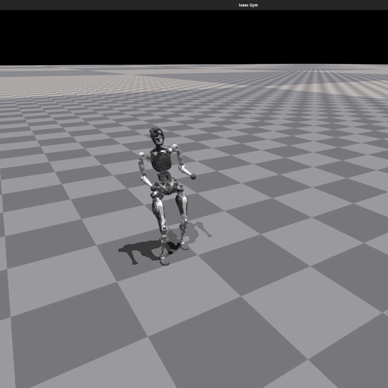

# Overview

<div align="center">

| Isaac Gym | Mujoco | Physical |
| --- | --- | --- |
| [](https://oss-global-cdn.PNDbotics.com/static/5bbc5ab1d551407080ca9d58d7bec1c8.mp4) | [](https://oss-global-cdn.PNDbotics.com/static/5aa48535ffd641e2932c0ba45c8e7854.mp4) | [](https://oss-global-cdn.PNDbotics.com/static/0818dcf7a6874b92997354d628adcacd.mp4) |

[](https://releases.ubuntu.com/20.04/)
[](https://www.nvidia.com/en-us/geforce/rtx/)
[](https://www.nvidia.com/Download/index.aspx)
[](https://www.python.org/downloads/release/python-380/)
[](https://developer.nvidia.com/isaac-gym)
[](https://mujoco.org/)


[](https://opensource.org/licenses/BSD-3-Clause)
[](https://github.com/pndbotics/pnd_rl_gym/issues)

**A compact, GPU-accelerated RL framework for PNDbotics robots *adam_lite_12dof*, integrating Isaac Gym–style parallel simulation, Mujoco validation. Provides low-level control APIs, high-throughput training environments, and reproducible Sim2Real pipelines optimized for robotics RL research.**

</div>

## 📋 Table of Contents

- [Installation & Configuration](#-installation--configuration)
- [Process Overview](#-process-overview)
- [User Guide](#-user-guide)
  - [Training](#1-training)
  - [Play](#2-play)
  - [Sim2Sim (Mujoco)](#3-sim2sim-mujoco)
  - [Sim2Real (Physical Deployment)](#4-sim2real-physical-deployment)
- [WandB Integration](#-wandb-integration)
- [Contributing](#-contributing)
- [License](#-license)
- [Acknowledgement](#-acknowledgement)
- [Contact](#-contact)
- [Version Log](#-version-log)

## 📦 Installation & Configuration

Please refer to [setup.md](/doc/setup_en.md) for installation and configuration steps.

## 🔁 Process Overview

The basic workflow for using reinforcement learning to achieve motion control is:

`Train` → `Play` → `Sim2Sim` → `Sim2Real`

- **Train**: Use the Gym simulation environment to let the robot interact with the environment and find a policy that maximizes the designed rewards. Real-time visualization during training is not recommended to avoid reduced efficiency.
- **Play**: Use the Play command to verify the trained policy and ensure it meets expectations.
- **Sim2Sim**: Deploy the Gym-trained policy to other simulators to ensure it’s not overly specific to Gym characteristics.
- **Sim2Real**: Deploy the policy to a physical robot to achieve motion control.

## 🛠️ User Guide

### 1. Training

```bash
screen -S pndbotics
cd ~/Documents/pnd_rl_gym
conda activate pnd_rl_gym
python legged_gym/scripts/train.py --task=adam_lite_12dof --headless
```

#### ⚙️ Parameter Description
- `--task`: Required parameter; values can be (adam_lite_12dof).
- `--headless`: Defaults to starting with a graphical interface; set to true for headless mode (higher efficiency).
- `--resume`: Resume training from a checkpoint in the logs.
- `--experiment_name`: Name of the experiment to run/load.
- `--run_name`: Name of the run to execute/load.
- `--load_run`: Name of the run to load; defaults to the latest run.
- `--checkpoint`: Checkpoint number to load; defaults to the latest file.
- `--num_envs`: Number of environments for parallel training.
- `--seed`: Random seed.
- `--max_iterations`: Maximum number of training iterations.
- `--sim_device`: Simulation computation device; specify CPU as `--sim_device=cpu`.
- `--rl_device`: Reinforcement learning computation device; specify CPU as `--rl_device=cpu`.

**Default Training Result Directory**: `logs/<experiment_name>/<date_time>_<run_name>/model_<iteration>.pt`

### 2. Play

To visualize the training results in Gym, run the following command:

```bash
python legged_gym/scripts/play.py --task=xxx
```

**Description**:

- Play's parameters are the same as Train's.
- By default, it loads the latest model from the experiment folder's last run.
- You can specify other models using `load_run` and `checkpoint`.

#### ⚙️ Additional Play Parameters

- `--test_default_pose`: Test default joint angles by setting all actions to zero. This is useful for verifying the robot's default standing posture without policy control.

#### 💾 Export Network

Play exports the Actor network, saving it in `logs/{experiment_name}/exported/policies`:
- Standard networks (MLP) are exported as `policy_1.pt`.
- RNN networks are exported as `policy_lstm_1.pt`.

### Play Results

| Adam Lite 12DOF |
| --- |
| []|

### 3. Sim2Sim (Mujoco)

Run Sim2Sim in the Mujoco simulator:

```bash
python deploy/deploy_mujoco/deploy_mujoco.py {config_name}
```

#### Parameter Description
- `config_name`: Configuration file; default search path is `deploy/deploy_mujoco/configs/`.

#### Example: Running Adam Lite 12DOF

```bash
python deploy/deploy_mujoco/deploy_mujoco.py adam_lite_12dof.yaml
```

#### ➡️ Replace Network Model

The default model is located at `deploy/pre_train/{robot}/motion.pt`; custom-trained models are saved in `logs/adam_lite_12dof/exported/policies/policy_lstm_1.pt`. Update the `policy_path` in the YAML configuration file accordingly.

#### Simulation Results

| Adam Lite 12DOF |
| --- |
| []|


### 4. Sim2Real (Physical Deployment)

Before deploying to the physical robot, ensure it’s in debug mode. Detailed steps can be found in the [Physical Deployment Guide](deploy/deploy_real/README.md):

```bash
python deploy/deploy_real/deploy_real.py {net_interface} {config_name}
```


#### Parameter Description
- `net_interface`: Network card name connected to the robot, e.g., `enp3s0`.
- `config_name`: Configuration file located in `deploy/deploy_real/configs/`, e.g., `adam_lite_12dof.yaml`.

#### Deployment Results

| Adam Lite 12DOF |
| --- |
| [](https://oss-global-cdn.PNDbotics.com/static/0818dcf7a6874b92997354d628adcacd.mp4) |


## 📊 WandB Integration

This project integrates with [Weights & Biases (WandB)](https://wandb.ai/) for advanced experiment tracking and visualization. WandB provides real-time metrics logging, model versioning, and collaborative experiment management.

### Features

- **Real-time Metrics Logging**: Track training loss, rewards, episode length, and custom metrics
- **Model Checkpointing**: Automatically save and version model checkpoints
- **Experiment Comparison**: Compare multiple training runs side-by-side
- **Hyperparameter Tracking**: Log all configuration parameters for reproducibility
- **Gradient Monitoring**: Watch model gradients and parameters during training

### Installation

WandB is included in the project dependencies. If not already installed:

```bash
pip install wandb
```

### Setup

1. **Create a WandB account** at [https://wandb.ai/](https://wandb.ai/)

2. **Login to WandB**:
   ```bash
   wandb login
   ```
   
   You'll be prompted to enter your API key, which can be found at [https://wandb.ai/authorize](https://wandb.ai/authorize)

3. **Verify installation** (optional):
   ```bash
   python scripts/test_wandb.py
   ```

### Usage

#### Enable WandB in Training

To enable WandB logging during training, add the `--wandb` flag:

```bash
python legged_gym/scripts/train.py --task=adam_lite_12dof --wandb
```

Or set WandB configuration in your task config file:

```python
class AdamLite12DofCfgPPO(LeggedRobotCfgPPO):
    class runner(LeggedRobotCfgPPO.runner):
        use_wandb = True  # Enable WandB logging
        wandb_project = "pndbotics_rl_gym"  # Your WandB project name
        wandb_entity = None  # Your WandB team/username (optional)
        wandb_tags = ["adam_lite_12dof", "rough_terrain"]  # Tags for organization
```

#### Configuration Options

You can customize WandB behavior through configuration:

```python
class runner:
    # WandB settings
    use_wandb = False          # Enable/disable WandB logging
    wandb_project = "pndbotics_rl_gym"  # WandB project name
    wandb_entity = None        # WandB team/username (optional)
    wandb_tags = []            # List of tags for the run
```

#### Logged Metrics

The WandB integration automatically logs:

- **Training Metrics**:
  - `Loss/value_function`: Value function loss
  - `Loss/surrogate`: Policy surrogate loss
  - `Train/learning_rate`: Current learning rate
  - `Train/mean_reward`: Average episode reward
  - `Train/mean_episode_length`: Average episode length

- **Timing Information**:
  - `Time/collection`: Data collection time
  - `Time/learn`: Learning update time

- **Episode Information**:
  - Custom reward components
  - Environment-specific metrics

- **Model Artifacts**:
  - Model checkpoints with version tracking
  - Final model with special "final" alias

### Advanced Features

#### Model Watching

The integration automatically watches model gradients and parameters:

```python
# This is done automatically in WandbOnPolicyRunner
wandb_logger.watch_model(model, log_freq=100)
```

#### Manual Logging

You can also manually log custom metrics:

```python
from legged_gym.utils import WandbLogger

logger = WandbLogger(
    project="my_project",
    experiment_name="my_experiment",
    run_name="my_run"
)

# Log custom metrics
logger.log({"custom_metric": value}, step=iteration)

# Log videos
logger.log_video("path/to/video.mp4", name="policy_video", step=iteration)

# Save model
logger.save_model("path/to/model.pt", aliases=["best"])
```

### Offline Mode

To run training without internet connection or WandB logging:

```bash
WANDB_MODE=disabled python legged_gym/scripts/train.py --task=adam_lite_12dof
```

Or set in Python:

```python
import os
os.environ['WANDB_MODE'] = 'disabled'
```

### Viewing Results

After starting a training run with WandB enabled:

1. A URL will be printed to the console, e.g.:
   ```
   [WandB] ✓ View run at: https://wandb.ai/your-username/pndbotics_rl_gym/runs/xxxxx
   ```

2. Click the URL or visit [https://wandb.ai/](https://wandb.ai/) to view:
   - Real-time training metrics and charts
   - System metrics (GPU/CPU usage, memory)
   - Model architecture and gradients
   - Hyperparameters and configuration
   - Saved model checkpoints

### Troubleshooting

#### Not Logged In

If you see an error about WandB not being logged in:

```bash
wandb login <your_api_key>
```

#### Import Errors

If WandB is not found:

```bash
pip install wandb
```

#### Testing Integration

Run the test script to verify everything is set up correctly:

```bash
python scripts/test_wandb.py
```

This will check:
- ✅ WandB installation
- ✅ Login status
- ✅ Integration with training code
- ✅ Configuration files

### Example Workflow

```bash
# 1. Install and login to WandB
pip install wandb
wandb login

# 2. Test the integration
python scripts/test_wandb.py

# 3. Start training with WandB
python legged_gym/scripts/train.py --task=adam_lite_12dof --wandb

# 4. Monitor training at https://wandb.ai/
# 5. Compare different runs and hyperparameters
# 6. Download model checkpoints from WandB
```

## 🤝 Contributing

Contributions are welcome.

Feel free to open issues or pull requests.

## 📄 License

[BSD-3 Clause © PNDbotics](./LICENSE)

## 🙏 Acknowledgments

- [legged_gym](https://github.com/leggedrobotics/legged_gym)
- [rsl_rl](https://github.com/leggedrobotics/rsl_rl.git)
- [mujoco](https://github.com/google-deepmind/mujoco.git)
- [pndbotics_sdk2_python](https://github.com/pndbotics/pndbotics_sdk2_python.git)

## 📞 Contact

- Email: info@pndbotics.com
- Wiki: https://wiki.pndbotics.com  
- SDK: https://github.com/pndbotics/pnd_sdk_python  
- Issues: https://github.com/pndbotics/pnd_mujoco/issues

## 📜 Version Log

| Version | Date       | Updates                                                                              |
| ------- | ---------- | ------------------------------------------------------------------------------------ |
| v1.0.0  | 2025-11-25 | Initial release |

---

<div align="center">

[](https://www.pndbotics.com)
[](https://x.com/PNDbotics)
[](https://www.youtube.com/@PNDbotics)
[](https://space.bilibili.com/303744535)

**⭐ Star us on GitHub — it helps!**

</div>
