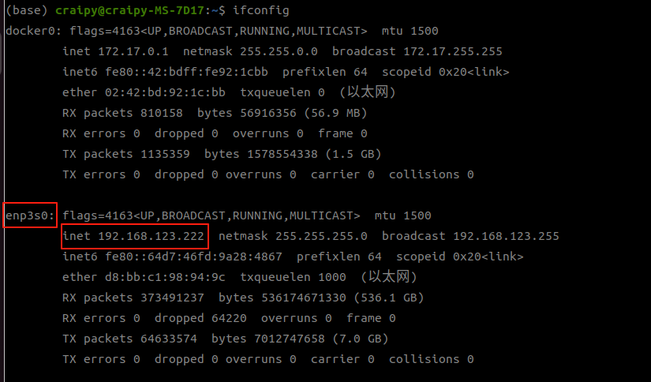

# Deploy on Physical Robot

This code can deploy the trained network on physical robots. Currently supported adam_lite_12dof.

## Startup Usage

```bash
python deploy_real.py {net_interface} {config_name}
```

- `net_interface`: is the name of the network interface connected to the robot, such as `enp3s0`
- `config_name`: is the file name of the configuration file. The configuration file will be found under `deploy/deploy_real/configs/`, such as `adam_lite_12dof.yaml`.

## Startup Process

### 1. Start the robot

Start the robot in the hoisting state and press the `A` key to enter `zero mode`. Then press `LT+B` key to enter `damping mode`.

### 2. Enter the user control mode

Make sure the robot is in `damping mode`, press the `LO+RO` key combination of the remote control; the robot will enter the `user control mode`, and the robot joints are in the damping state in the `user control mode`.

### 3. Connect the robot

Use the `ifconfig` command to view the name of the network interface connected to the robot. Record the network interface name, which will be used as a parameter of the startup command later.



### 4. Start the program

Assume that the network card currently connected to the physical robot is named `enp3s0`. Take the adam_lite_12dof robot as an example, execute the following command to start

```bash
python deploy_real.py enp3s0 adam_lite_12dof.yaml
```

#### 4.1 Exit control

In `user control mode`, press the `LT+B` button on the remote control, the robot will enter the `damping mode` and fall down. Then press the `LT + RT` button to exit program. 

> Note:
>
> Since this example deployment is not a stable control program and is only used for demonstration purposes, please try not to disturb the robot during the control process. If any unexpected situation occurs during the control process, please exit the control in time to avoid danger.

